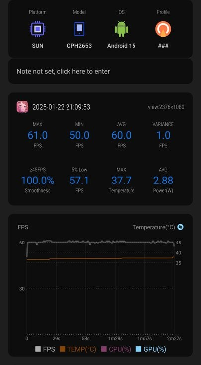

+++
date = '2025-04-10T18:52:39+09:00'
title = 'OnePlus 13 長期レビュー'
+++

OnePlus 13 (CN Version) Black を購入してからしばらく経ったので、使用感などをメモ

## 目次

- [スペック](#スペック)
- [外観](#外観)
  - [ディスプレイ](#ディスプレイ)
- [使用感](#使用感)
  - [ソフトウェア](#ソフトウェア)
    - [コンバート](#コンバート)
    - [Share with iPhone](#share-with-iphone)
  - [カメラ](#カメラ)
  - [ゲーム](#ゲーム)
- [その他](#その他)
  - [バッテリー](#バッテリー)
  - [スピーカー](#スピーカー)
  - [指紋認証](#指紋認証)
- [おわりに](#おわりに)

## スペック

詳細は（めんどくさいので）割愛しますが、

- SoC: Snapdragon 8 Elite

カメラ構成は以下

- メインが LTY-808 (1/1.4)
- 望遠が 3x ですがテレマクロ非対応
- 超広角が JN1

ほか

- バッテリー: 6000mAh
- USB: 3.2 Gen 1

## 外観

背面の質感・触り心地はかなり良いです。

写真だとイマイチに見えていたのですが、実際に触ると所有感が満たされます。
もともと青のレザータイプを購入予定だったのですが、黒色で満足してしまいました。

個人的には側面のボタン配置もちょうど良いです。
指にボタンがかかるか、かからないかぐらいの塩梅です。

### ディスプレイ

あとはディスプレイはほぼフラットで、本体も X100 Pro のように左右の端が薄くならないので持ちやすいです。（とは言っていますが、結局ケースつけるのであまり変わらないかもですが・・・）

Xiaomi 14 Ultra とだいたい同じくらいカーブしている気がしますが、ケースで覆われるので対して気になりません（というかこれは Mi 14 Ultra が Photography kit のケースを使っているから目立っている説があります）。

## 使用感

### ソフトウェア

標準で搭載されている OS は ColorOS 15 です。

自動起動が 5 個までの制限などありますが、個人的には通知来ないのは気にしていないのであまり気になっていません。

初めて使いましたが、設定アプリのデザインが好みです。

また、ライブアラートは普通に便利です。（タイマーを使うことが多いのでありがたい）

ただ、大陸版なので生身な OS だと微妙な使いずらさはもちろんあります（が、百も承知で使用しているので慣れだと思います）。

#### コンバート

標準では ColorOS ですが、有志の天才によって OxygenOS にコンバートすることができます。

BLU + Root 化(ほぼ必須)ですが、大陸版特有の

- Quick Share
- ロケーション履歴

などが使えない制限を解除できます。（BLU してドライバ入れてバッチ走らせるだけなので）あまりにもありがたすぎます。足を向けて寝れないです。

OTA も専用 Module の Action が必要ですが、ローカルインストール後にぽちっと押してから Restart するだけなので、めちゃくちゃ簡単です。

OxygenOS ですが、ColorOS の自動起動の制限などもなく、プリインストールアプリも中華アプリがないので単純に使いやすいです。ちなみにランチャーとかは別に使ってないのでそこらへんはわかんないです。

不満があるとすれば EU ROM でないと OPPO Share が使えなくなるぐらいです。あとは映像を PinP させて一時停止 → 復帰後の挙動がイマイチ（これは他の OS でも言えますが・・・）

個人的には Hyper OS よりもデザインが好みで好印象です。

長らく OxygenOS を使っていますが、若干飽きてきたので ColorOS にでも戻そうかなと思ってます。二度美味しいね

#### Share with iPhone

OPPO Share と O+Connect で AirDrop する的なやつです。

転送速度に関しては申し分ない（適当に測って 560Mbps ぐらい）ですが、不満点をあげるとすれば素の OPPO / Mi Share と比較すると接続確立までの時間が長いな～という印象でした。

今後のアップデートに期待

### カメラ

カメラに関しては Xiaomi 14 Ultra があるので真面目には使っていないですが、Xiaomi にはないフィルターで遊べるので楽しいです。

テレマクロがあればもう少し遊べたかな？という印象です。とはいえ、取り回しの良さは OnePlus が上回るので、ササッと撮ったり気分転換に良く使いました。

### ゲーム

Snapdragon 8 Elite なので文句はなにもないです。

ColorOS であれば原神でアップスケール（？）とフレーム補完が可能なようです。原神はしないので使ってませんが・・・

主にプレイしているのが学マスだったのですが、最高設定のライブで average FPS が 60 出ます。余裕です。

試しに Scene で 最高設定の Tame-Lie-One-Step を計測してみたのが ↓ です。

1 枚目と 3 枚目のグラフを見ると、フレームレートの安定具合が全く異なっていて感動しました。そして消費電力はほぼ半分という恐ろしさ・・・（2 枚目と 4 枚目）

▽ OnePlus 13 (8 Elite)

▽ Xiaomi 14 Ultra (8 Gen 3)

発熱に関しても普通に使う分にはじんわりあったかくなるぐらいです。

さすがに scrcpy + 学マスをすると熱くなります。

ちなみにいわゆる Bypass Power (≒ バイパス給電？名称がたくさんあってよくわからない)も可能です。負荷がかかるとバッテリーからも消費されるみたいです。

が、それでもバッテリーに優しいのはありがたいです。

（今後のアップデートで完全に AC 電源から給電可能になるらしい？）

### その他

#### バッテリー

ColorOS であれば 2 日間くらい持ち、OxygenOS であれば 1~1.5 日ぐらい持ちます。

勝手にバックグラウンドでゴリゴリ減らないです。

何度も引き合いに出る Xiaomi 14 Ultra と比較すれば文句は全くないです。神とさせてください。

#### スピーカー

左右非対称のスピーカーです。Holo Audio はオン / 自動で使っています。

iPhone 15/ 16 比で同じくらいな気がしますが、個人的に好きなほうは OnePlus 13 です。

vivo X100 Pro / Xiaomi 14 Ultra に比べて低音がしっかり出ていてスカスカ感がない気がします。

#### 指紋認証

超音波式で爆速です。

vivo X100 Pro はセンサーが下目だったり、Xiaomi 14 Ultra は光学式なので感度が悪い・・・といった欠点もなく、ちょうどいいセンサー位置に感度抜群のセンサーなのでなにも文句がありません。すべてのスマホにこれがあって欲しいです。

## おわりに

カメラを使わないのであれば、あまり隙が無いスマホな気がしました（グロ版なら尚更）。興味本位で買ったのですが、総合的に満足度が高かったです。

競合は POCO F7 Ultra とかになるんでしょうか。入手性を考えるとわざわざ OnePlus を選んで買う人は少なさそうですが・・・

OnePlus 気になってる！みたいな人にはいいかもですね。

おわり
